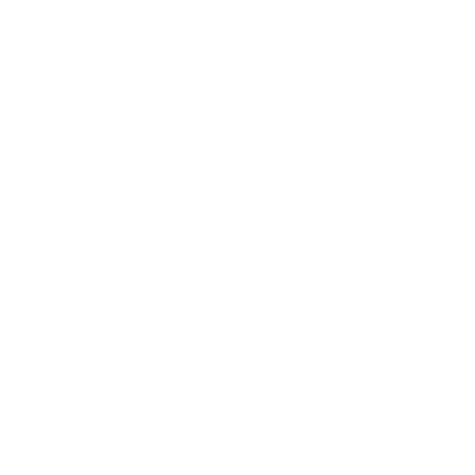

# Getting Started with Vessel Mechanical Log

## This Project is being built.  Try and Visit later... 

This Repository is designed to Add to or Edit Styles and Javascript for the Vessel Mechanical Log.

This Server.js is saving Vessel data into data/vessels.json and this is for testing purposes only.  The real app Hosted on Heroku is using Vessels repository.  

This Repository is strictly controlling the Script and Style functionality and all pushed changes into github will instantly translate to the Heroku Site. 

